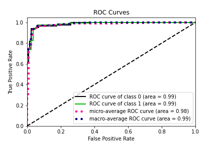
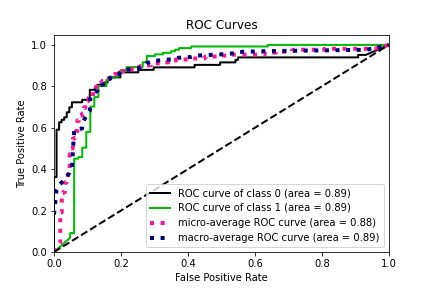

### Misc.
- This is a project archive.
- Project stack: **fast.ai**, run on **Google Colab P100** mounted data on GDrive, checkpoint used to get around 24 hours timelimit of Colab
- Project dated **Jan 2020**
- This only contains the core code (which might be outdated), data from APTOS or HKU is not found in this repo.

# Diabetic retinopathy referral classification
- Model base: Efficientnets B3 - B7, ensemble
- Pretraining: APTOS
- Fine-tuning: Hong Kong local fundoscopy photos
- 2 fields fundoscopy is used to increase the detection rate during fine tuning

### Results
- [AUC=0.95]
- [Sn=95%, Sp=87.2%]
- Best fold [n=5]
 
- Worst fold [n=5]

### Acknolwedgements
- [Kaggle kernels](https://www.kaggle.com/pranavpulijala/efficientnetb3-with-fast-ai-tutorial-aptos-2019 "Kaggle kernels")
- [@lukemelas](https://github.com/lukemelas/EfficientNet-PyTorch/blob/master/efficientnet_pytorch/)
- APTOS dataset
- HKU dataset